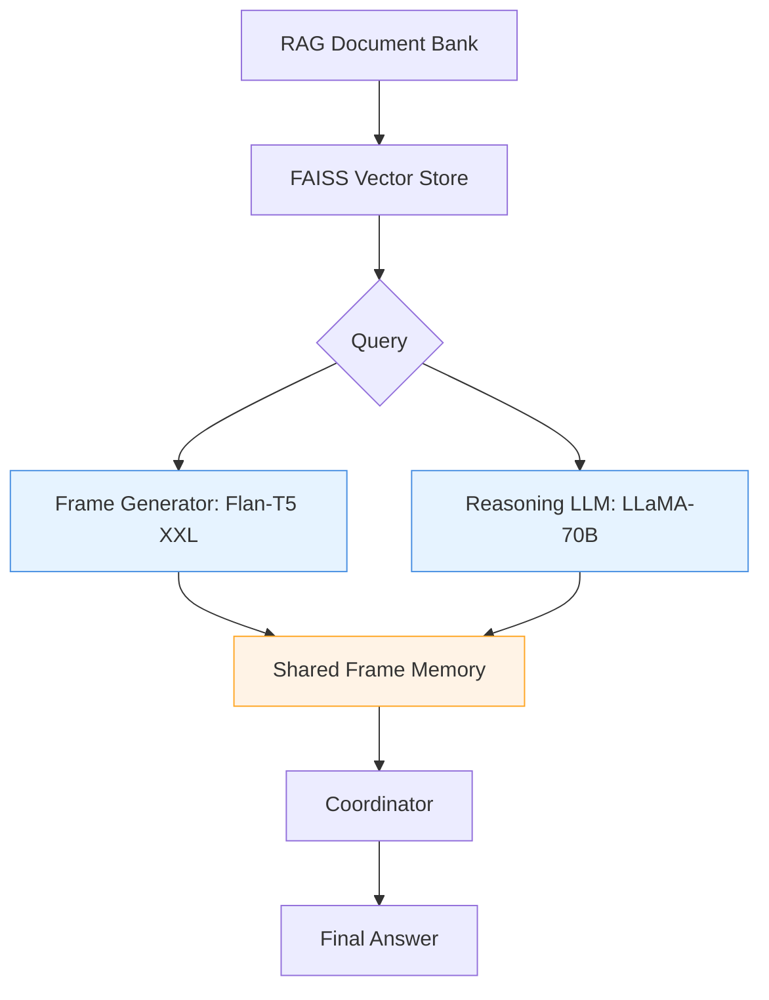

# Summary of the Idea: A Two-Stage RAG System with Formal Semantic Frames

## Overview
The goal is to create a technical assistant that combines the strengths of neural retrieval and symbolic reasoning to provide precise, explainable, and reliable answers to complex technical queries. The system uses a two-stage architecture:

### Stage 1: Frame Extraction
A smaller, efficient LLM (e.g., Flan-T5 XXL) processes document chunks and extracts formal semantic frames. These frames are structured representations of the content using logic forms (e.g., first-order logic, temporal logic), capturing the meaning of the text in a mathematically rigorous way.

### Stage 2: Reasoning
A larger, more powerful LLM (e.g., LLaMA-70B, openAI o1-mini, etc) uses these frames to perform step-by-step (CoT) reasoning. It dynamically requests additional frames as needed. The reasoning process is guided by the formal structure of the frames, ensuring logical consistency and reducing hallucinations.

### Parallel Operation
The system operates in parallel: while the reasoning LLM processes the initial frames, the frame generator continuously produces new frames from relevant document chunks. This parallelization reduces latency and refines reasoning as new information becomes available.

---

## Key Components in Action

### 1. Frame Extraction (Stage 1)
The smaller LLM converts raw text into formal semantic frames. For example:

**Input Text:**
"Before performing high-voltage maintenance, technicians must de-energize the circuit and verify zero voltage using a calibrated tester."

**Output Frame:**
```prolog
SafetyProcedure(s1) ∧
Requires(s1, Sequence(
    Deenergize(actor: Technician, object: HV_Circuit),
    Verify(actor: Technician, method: Voltage_Test, tool: Calibrated_Tester)
)) ∧
AppliesTo(s1, HighVoltageMaintenance)
```

This frame captures the entities (Technician, HV_Circuit), actions (Deenergize, Verify), and constraints (Sequence, Calibrated_Tester) in a structured, machine-readable format.

### 2. Reasoning with Frames (Stage 2)
The larger LLM uses the frames to perform step-by-step reasoning. For example:

**User Query:**
"What are the safety steps for high-voltage maintenance?"

**Reasoning Process:**

1. Retrieve all `SafetyProcedure` frames related to `HighVoltageMaintenance`.
2. Identify the sequence of actions (Deenergize → Verify).
3. Validate the tools and methods (Calibrated_Tester, Voltage_Test).
4. Check for additional constraints (e.g., grounding requirements).

**Final Answer:**
"Required steps: 1) De-energize the circuit. 2) Verify zero voltage using a calibrated tester. 3) Install safety grounds."

---

## Why This Works Better

### 1. Formal Logic Reduces Hallucinations
By grounding the reasoning process in formal logic, the system avoids unsupported claims. For example:

- **Without frames:** "Use insulated gloves during maintenance." (potentially incorrect)
- **With frames:** "Verify zero voltage before proceeding." (provably correct, based on the frame)

### 2. Dynamic Frame Injection Improves Reasoning
The reasoning LLM can request additional frames to fill gaps in understanding. For example:

- **Initial Frame:** `Deenergize(actor: Technician, object: HV_Circuit)`
- **New Frame Request:** "What tools are required for de-energizing?"
- **Additional Frame:** `Requires(Deenergize, tool: Safety_Switch)`

### 3. Parallel Processing Reduces Latency
While the reasoning LLM processes the initial frames, the frame generator continuously produces new frames from relevant document chunks. This overlap ensures quick answers without sacrificing accuracy.

---

## Real-World Example

**Input Scenario:**
A technician asks:
"What should I do if I detect an overheating transformer during routine maintenance?"

**System Execution:**

### Frame Extraction:
1. From maintenance manual:
   ```prolog
   FaultResponse(f1) ∧
   Trigger(f1, Overheating(Transformer)) ∧
   Requires(f1, Sequence(
       Shutdown(actor: Technician, object: Transformer),
       Notify(actor: Technician, recipient: Supervisor),
       Inspect(actor: Technician, object: Cooling_System)
   ))
   ```
2. From safety guidelines:
   ```prolog
   SafetyRule(s1) ∧
   Requires(s1, WearPPE(actor: Technician, type: Insulated_Gloves)) ∧
   AppliesTo(s1, Transformer_Maintenance)
   ```

### Reasoning Process:
1. Identify the fault (`Overheating(Transformer)`).
2. Retrieve the response sequence (`Shutdown → Notify → Inspect`).
3. Check for additional safety requirements (`WearPPE`).

**Final Answer:**
"If you detect an overheating transformer: 1) Shut it down immediately. 2) Notify your supervisor. 3) Inspect the cooling system. Always wear insulated gloves during maintenance."

---

## Key Benefits

### Precision
Formal logic ensures answers are mathematically sound.

### Explainability
Every conclusion is backed by a traceable logic path.

### Efficiency
Parallel processing keeps latency low.

### Scalability
The system can handle millions of documents and frames.

---

## Architecture and Workflow Diagrams

### System Architecture


### Workflow Example


---

## Technical Requirements

- **Latency:** < Shall be compatible to Larger LLM latency, utilizing parallelism
- **Accuracy:** Expected to be better TechQA benchmarks
- **Scaling:** May handle up-to 1M+ frames
- **Throughput:** May process dosens of requests/second
- **Explainability:** Provides full logic traces

---

## Innovations

### Parallel Frame Generation
Concurrent processing by frame extraction and reasoning components.

### Dynamic Frame Injection
Allows reasoning LLM to request and incorporate new frames during the reasoning process.

### Formal Consistency
Ensures low hallucination rate by grounding in formal logic.

### Traceability
Maintains a complete audit trail of reasoning steps for validation and debugging.
